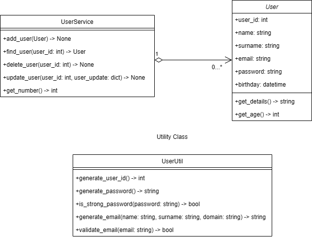

# User Class Methods 🚀

This repository contains a Python project that demonstrates the use of class and static methods in object-oriented programming (OOP).

## Features ✨

- Define a `User` class with attributes and methods.
- Create and manage user instances.
- Use `UserService` to manage a collection of `User` objects.
- Provide utility functions with `UserUtil`.
- Demonstrate the use of class methods for alternative constructors.
- Include unit tests for all classes.

## Classes 📚

### User 👤

Represents a user with attributes and methods.

**Attributes:**
- `user_id`: The unique identifier for the user.
- `name`: The name of the user.
- `surname`: The surname of the user.
- `email`: The email of the user.
- `password`: The password of the user. `None` by default.
- `birthday`: The birthday of the user. `None` by default.

**Methods:**
- `get_details()`: Returns all attributes in the formatted manner.
- `get_age()`: Calculates and returns the age of the user.

**Sample Usage:**
```python
from user import User
from datetime import datetime

user = User(12345, "Alice", "Johnson", datetime(1990, 5, 15))
print(user.get_age())  # Output: 34
```

### UserService 🛠️

Manages a collection of `User` objects.

**Attributes:**
- `users`: A dictionary to store `User` objects with their `user_id` as the key.

**Methods:**
- `add_user(user)`: Adds a `User` object to the `users` variable.
- `find_user(user_id)`: Finds and returns a `User` object by `user_id`.
- `delete_user(user_id)`: Deletes a `User` object by `user_id`. Calls `find_user(user_id)` and prints out `"Deletion failed. User with given id is not in the list"` if the `User` is not in the collection.
- `update_user(user_id, **kwargs)`: Updates the attributes of a `User` object. Calls `find_user(user_id)` and prints out `"Update failed. User with given id is not in the list"` if the `User` is not in the collection.
- `get_number()`: Returns the total number of users.

**Sample Usage:**
```python
from userservice import UserService
from user import User
from datetime import datetime

user1 = User(12345, "Alice", "Johnson", datetime(1990, 5, 15))
user2 = User(67890, "Bob", "Smith", datetime(1985, 8, 22))

UserService.add_user(user1)
UserService.add_user(user2)

print(UserService.get_number())  # Output: 2
print(UserService.find_user(67890).name)  # Output: Bob

UserService.update_user(67890, name="Robert")
print(UserService.find_user(67890).name)  # Output: Robert

UserService.delete_user(12345)
print(UserService.get_number())  # Output: 1
```

### UserUtil 🔧

Provides utility functions related to users.

**Methods:**
- `generate_user_id()`: Generates user ID.
- `generate_password()`: Generates secure password.
- `validate_email(email)`: Validates the given email address.
- `is_strong_password(password)`: Checks if the given password is strong.
- `generate_email(first_name, last_name, domain)`: Generates an email address based on the given first name, last name, and domain.

**Sample Usage:**
```python
from userutil import UserUtil

print(UserUtil.validate_email("alice.johnson@gmail.com"))  # Output: True
print(UserUtil.is_strong_password("Str0ngP@ssw0rd"))  # Output: True
print(UserUtil.generate_email("Alice", "Johnson", "gmail.com"))  # Output: alice.johnson@gmail.com
```

### Testing Classes 🧪

The project includes unit tests for the `User`, `UserService`, and `UserUtil` classes using the `unittest` framework.

#### TestUser

Tests the `User` class.

**Methods:**
- `test_get_age()`: Tests the `get_age()` method.
- `test_user_id()`: Tests the `user_id` attribute.
- `test_name_change()`: Tests changing the `name` attribute.

#### TestUserService

Tests the `UserService` class.

**Methods:**
- `test_add_users()`: Tests adding users to the `UserService`.
- `test_find_user()`: Tests finding a user by `user_id`.
- `test_delete_user()`: Tests deleting a user by `user_id`.
- `test_update_user()`: Tests updating a user's attributes.
- `test_get_number()`: Tests getting the total number of users.

#### TestUserUtil

Tests the `UserUtil` class.

**Methods:**
- `test_validate_email()`: Tests the `validate_email()` method.
- `test_is_strong_password()`: Tests the `is_strong_password()` method.
- `test_generate_email()`: Tests the `generate_email()` method.

**Sample Usage:**
```bash
# Run all tests
python -m unittest main.py
```

## UML Diagram 📊



## Installation 🛠️

1. Clone the repository:
    ```bash
    git clone https://github.com/kd0nwww/user_class_methods.git
    ```
2. Navigate to the project directory:
    ```bash
    cd user_class_methods
    ```

## Usage 🚀

1. Run the main script to see the class methods in action:
    ```bash
    python main.py
    ```

2. Run the tests to ensure everything is working correctly:
    ```bash
    python -m unittest main.py
    ```
